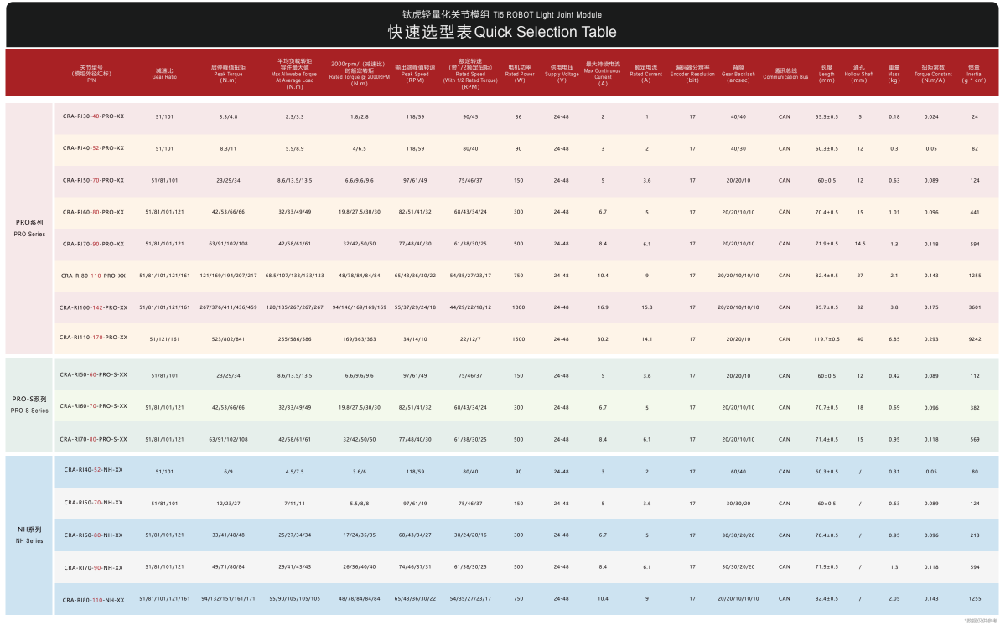

# Actuator Sizing. 

**Choose custom motors for the UR3 manipulator**

I used the baseline model of the UR3 manipulator from this [repository](https://github.com/Daniella1/urdf_files_dataset/tree/main).

## Project structure

- **Configuration Files**: Motor configuration parameters are stored in the `/config` folder in `.toml` format.
- **Model Parser**: The `_model_parser.py` file inside the `/src` folder parses these configurations and updates the baseline model accordingly. The updated model is stored in the `/models` folder as an XML file.

Currently, four motor configurations are provided for testing and simulation.

## Launch instrucitons

To launch the simulation, you can use the following command:

```
cd models
python -m mujoco.viewer --mjcf=1_robot_model.xml 
```
You can replace `1_robot_model.xml` with any of the four available models.


Alternatively, you can launch the `simulation.py` script:

```
cd src
python3 simulation.py 
```

## Explanation of Motor Choice

The main motor's models I used were:

- CRA-RI80-110-PRO-XX
- CRA-RI80-110-NH-XX

from this selection table:



I chose them primarily because of the appropriate geometrical parameters.

For the shoulder joints, I used large gear ratios, approximately 161:1 or 121:1.

For the elbow joint, I used a smaller ratio of 121:1 or 101:1.

The smallest gear ratio was used for the wrist joint, with a ratio of 51:1.